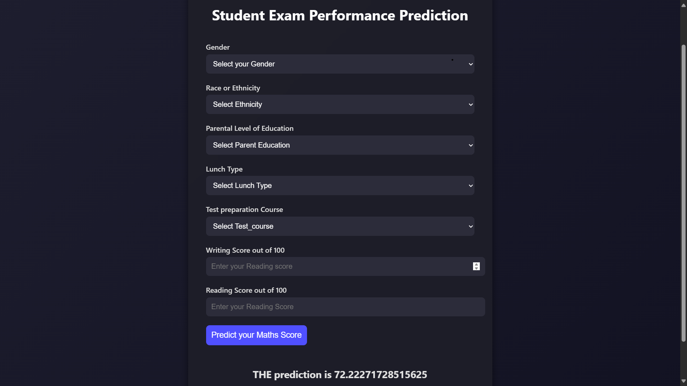

# 📊 Student Exam Performance Prediction

A machine learning web application that predicts a student's **Maths Score** based on demographic and academic inputs like gender, parental education, lunch type, reading and writing scores, and more.

> 🚀 This project uses a trained ML regression model deployed with a user-friendly web interface to demonstrate the real-world application of predictive analytics in education.  
> 🏗️ The entire project follows **industry-standard structure**, making it modular, scalable, and ready for deployment or integration into larger systems.


## 🔍 Features

- 🎓 Predicts Maths exam score based on:
  - Gender
  - Race/Ethnicity
  - Parental level of education
  - Lunch type
  - Test preparation course
  - Reading & Writing scores
- 🧠 ML model trained on real-world educational data
- 🌐 Clean, responsive, dark-themed web UI
- 🔢 Real-time prediction with model inference
- 📦 Extensible backend architecture for scaling

---

## 🛠️ Tech Stack

| Layer       | Technology              |
|------------|--------------------------|
| Frontend   | HTML, CSS, JavaScript  |
| Backend    | Python, Flask  |
| ML Model   | Scikit-learn, Pandas, NumPy |


---

## 📸 Screenshot




---
## ⚙️ Workflow

### ✅ Exploratory Data Analysis (EDA)
- Distribution plots to understand variable spread
- Univariate and multivariate analysis of feature columns

### ✅ Preprocessing
- Applied `StandardScaler` for feature scaling
- Used `OneHotEncoder` for categorical features
- Combined preprocessing using `ColumnTransformer`
- Hyperparameter tuning performed with `GridSearchCV`

### ✅ Model Training & Evaluation
- Models tried:
  - Random Forest Regressor
  - Decision Tree Regressor
  - Gradient Boosting Regressor
  - Linear Regression ✅
  - XGBoost Regressor
  - CatBoost Regressor
  - AdaBoost Regressor
- **Best Model**: Linear Regression  
  - Accuracy (R²): **0.88**

```bash
student-performance-predictor/
│
├── artifacts/ # Stores intermediate and final ML artifacts (e.g., models, transformers)
├── catboost_info/ # CatBoost internal files 
├── logs/ # Logging outputs
├── mlprojects.egg-info/ # Packaging metadata
├── notebook/ # Jupyter notebooks for EDA, experimentation
├── src/ # Source code
│ ├── components/ # Core components for pipeline steps
│ │ ├── data_ingestion.py
│ │ ├── data_transformation.py
│ │ └── model_trainer.py
│ ├── pipeline/ # Prediction and training pipeline definitions
│ │ ├── predict_pipeline.py
│ │ ├── train_pipeline.py
│ │ ├── exception.py # Custom exception handling
│ │ ├── logger.py # Logging utility
│ │ └── utils.py # Common utility functions
│ └── init.py
│
├── templates/ # HTML templates for the web interface
├── venv/ # Python virtual environment (excluded from version control)
├── application.py # Flask app entry point
├── requirements.txt # Project dependencies
├── setup.py # Setup script for packaging
├── screenshot.png # UI screenshot
└── README.md # Project documentation

```

## 🚀 How to Run Locally

1. Clone the repository

```bash
git clone https://github.com/Satyam255/Student_Performance_Indicator.git
cd Student_Performance-Indicator
```
2. Install dependencies

```bash

pip install -r requirements.txt
```
3. Run the Flask app
```bash

python application.py
```
4. Open in browser
```bash
Visit http://localhost:5000 in your browser.
```
